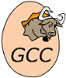

# University_Programming_Labs

## Что внутри?
В этом репозитории собраны работы выполненные в университете в рамках дисциплины "Программирование на C++".

## Используемые инструменты разработки при выполнении работ:

## Содержание ( Клик по разделу )

semester_1

1. [Ввод-вывод, арифметические операции](https://github.com/eaivanof/University_Programming_Labs/tree/main/semester_1/lab_1.1)

2. [Условия и циклы](https://github.com/eaivanof/University_Programming_Labs/tree/main/semester_1/lab_1.2)

3. [Системы счисления](https://github.com/eaivanof/University_Programming_Labs/tree/main/semester_1/lab_1.3)

4. [Битовые операции](https://github.com/eaivanof/University_Programming_Labs/tree/main/semester_1/lab_1.4)

5. [Представление данных в компьютере](https://github.com/eaivanof/University_Programming_Labs/tree/main/semester_1/lab_1.5)

6. [Указатели и массивы](https://github.com/eaivanof/University_Programming_Labs/tree/main/semester_1/lab_1.6)

7. [Поиск и сортировка](https://github.com/eaivanof/University_Programming_Labs/tree/main/semester_1/lab_1.7)

8. [Функции и рекурсия](https://github.com/eaivanof/University_Programming_Labs/tree/main/semester_1/lab_1.8)

semester_2

1. [Работа со средством автоматизации сборки ПО CMake и компилятором GCC в редакторе кода Visual Studio Code. Отладка программного кода на языке С++](https://github.com/eaivanof/University_Programming_Labs/tree/main/semester_2/lab_2.1);

2. [Работа с базовым контейнером vector на языке программирования С++](https://github.com/eaivanof/University_Programming_Labs/tree/main/semester_2/lab_2.2);

3. [Работа с базовым контейнером string на языке программирования С++](https://github.com/eaivanof/University_Programming_Labs/tree/main/semester_2/lab_2.3);

4. [Использование сторонних библиотек на примере OpenCV для создания программ на языке С++](https://github.com/eaivanof/University_Programming_Labs/tree/main/semester_2/lab_2.4);

5. [Прототипы функций. Многофайловые проекты. Конфликты имён. Обработка исключений try-catch](https://github.com/eaivanof/University_Programming_Labs/tree/main/semester_2/lab_2.5);

6. [Структуры. Перегрузка операторов. Наследование. Классы. Методы классов](https://github.com/eaivanof/University_Programming_Labs/tree/main/semester_2/lab_2.6)

7. [Unit-тестирование](https://github.com/eaivanof/University_Programming_Labs/tree/main/semester_2/lab_2.7)

8. [Работа с хэшированием данных, текстовыми файлами](https://github.com/eaivanof/University_Programming_Labs/tree/main/semester_2/lab_2.8)

summer_practice

- [Игровая программа "EndlessRunner"](https://github.com/eaivanof/University_Programming_Labs/tree/main/summer_practice)

semester_3

1. [Система сборки build, test and deploy](https://github.com/eaivanof/University_Programming_Labs/tree/main/semester_3/lab_3.1)

2. [Особенности C++11. auto, lambda, tupleЗадание](https://github.com/eaivanof/University_Programming_Labs/tree/main/semester_3/lab_3.2)

3. [Реализация контейнеровЗадание](https://github.com/eaivanof/University_Programming_Labs/tree/main/semester_3/lab_3.3)

4. [Идея и реализация аллокаторовЗадание](https://github.com/eaivanof/University_Programming_Labs/tree/main/semester_3/lab_3.4)

5. [ООП. Структуры и классыЗадание](https://github.com/eaivanof/University_Programming_Labs/tree/main/semester_3/lab_3.5)

6. [Принципы проектирования ПОЗадание](https://github.com/eaivanof/University_Programming_Labs/tree/main/semester_3/lab_3.6)

7. [Библиотека Boost. Паттерны проектированияЗадание](https://github.com/eaivanof/University_Programming_Labs/tree/main/semester_3/lab_3.7)

