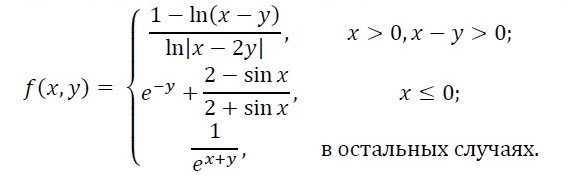
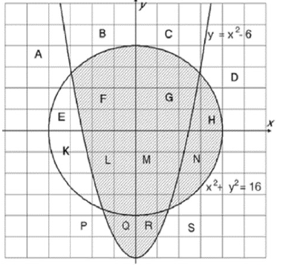

# Лабораторная работа №1.2 по дисциплине "Программирование". Условия и циклы

## Цель работы
Научиться составлять программы содержащие ветвления и циклы. Изучить имеющийся для этого синтаксис в языке С++.

## Задание

1. Ввести с клавиатуры четыре цифры. Вывести все возможные различные «счастливые» номера, которые из них можно составить. Номер «счастливый», если сумма двух первых цифр совпадает с суммой двух последних;

2. Ввести с клавиатуры вещественные числа x, y и вычислить значение выражения:

3. Ввести с клавиатуры координаты точки x и y и проверить принадлежность точки закрашенной области (включая границы).

 
4. Ввести с клавиатуры значение x. Вычислить приближенно значение функции через сумму ряда. Суммирование производить до тех пор, пока модуль очередного слагаемого не станет меньше $10^{-7}$.

$$ arctg(x) = \dfrac{\pi}{2} - \dfrac{1}{x} + \dfrac{1}{3x^3} - \dfrac{1}{5x^5} + \dots, \ x>1 $$

